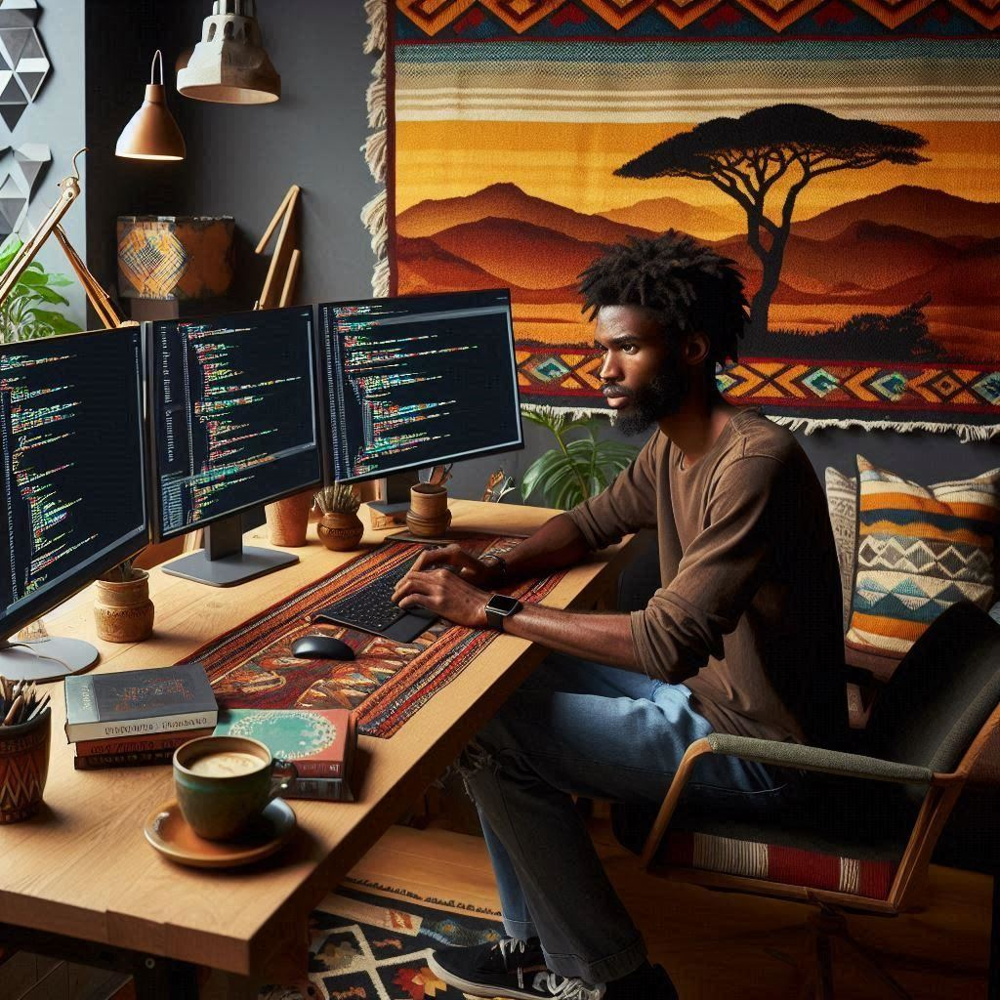

# Portfolio

  
 <!-- 

  
  
  

  

<h1 align="center">
  hey there
  
</h1>

<!-- 
 
### :woman_technologist: About Me :
Hi, I'm Girma Terfa, a Junior Computer Science student at UCSD. Dynamic and results-oriented candidate with a proven ability to effectively manage diverse tasks and projects while maintaining a positive attitude. Demonstrates a strong commitment to team success and eagerly embraces additional responsibilities to drive organizational growth and excellence.

🔭 I’m working towards my Bachelor's degree while actively engaging in research and learning about Machine Learning and Artificial Intelligence.

🌱 Exploring the vast field of technology and constantly seeking new knowledge and challenges.

⚡ In my free time, I enjoy solving problems on LeetCode and going for hikes/walks.

📫 How to reach me: )

### :hammer_and_wrench: Languages and Tools :

  &nbsp;
  &nbsp;
  &nbsp;
  &nbsp;
  &nbsp;
  &nbsp;
  

### :fire: My Stats :

### :writing_hand: Blog Posts :
<!-- BLOG-POST-LIST:START -->
<!-- BLOG-POST-LIST:END -->
 
This is my portiolio. It contains some of my stories, project highlights, expriences and etc
